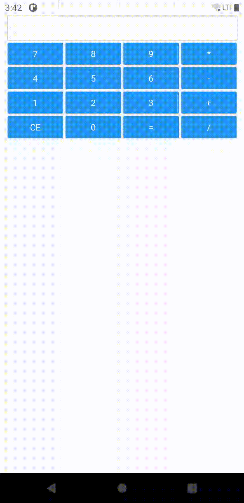

# aplikacje-mobilne-21716-185IC Lab1 - kalkulator

## kod programu

### 1) Flatlist renderuje liste, w tym przypadku będą to przyciski poukładane 4 w wieru i 4 w kolumnie.

### 2) Po wciśnięciu przycisku zostanie wywołana funkcjia sum() do której zostanie przekazany parametr 'item.key', przekazany parametr różni się w zależności od przycisku.

### 3) Wewnątrz funkcji sum() w zależności od spełnionego warunku, zostanie wykonana odpowiednia operacja i przypisana do zmiennej count.

### 4) Podczas wciskania przycisków na bierząco są wyświetlane aktualne dane.

## przykład działania programu
