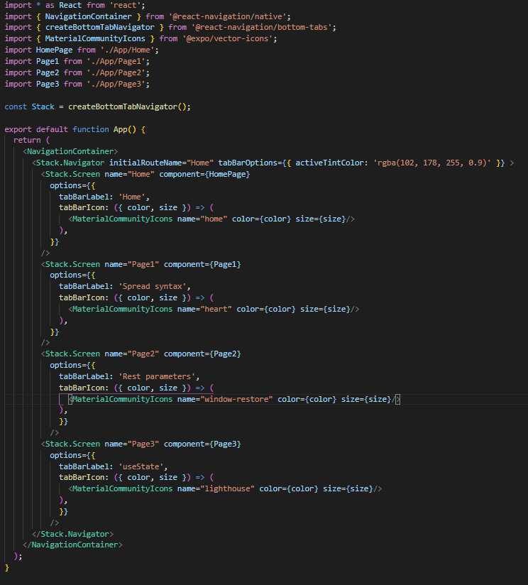
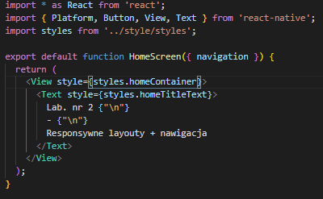
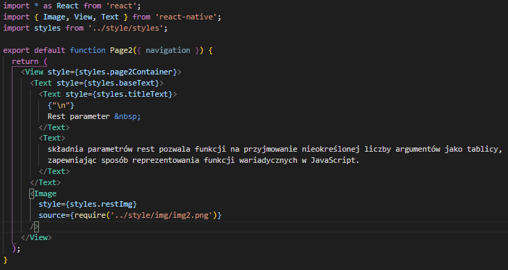
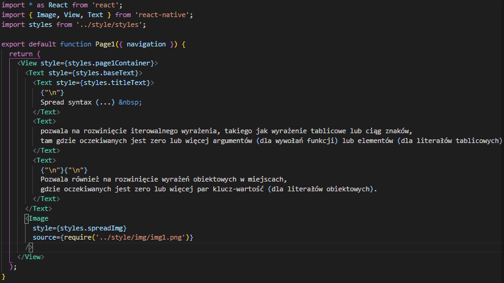
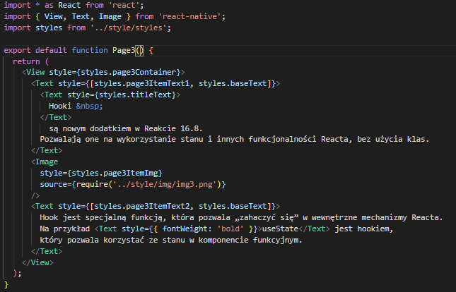
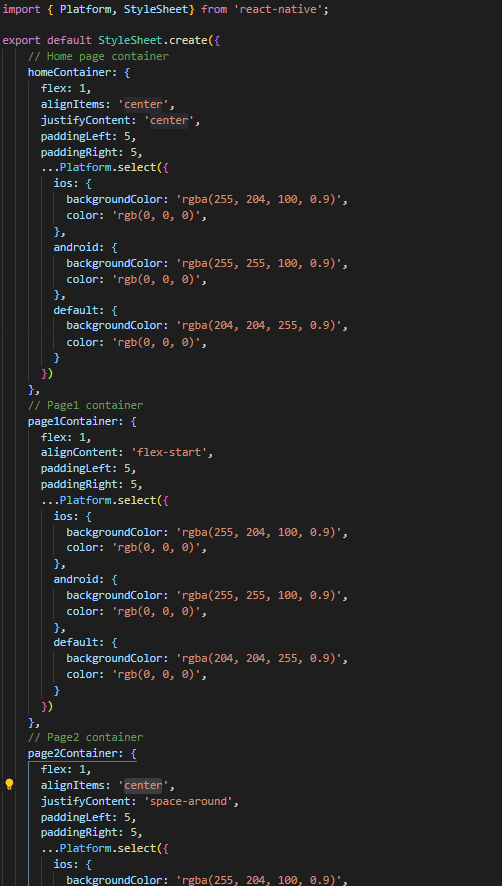
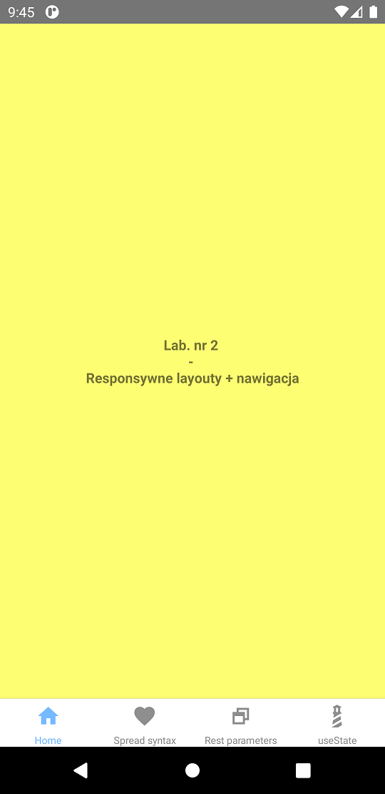
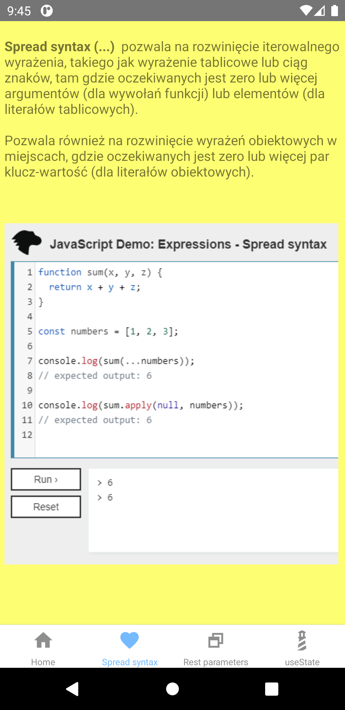
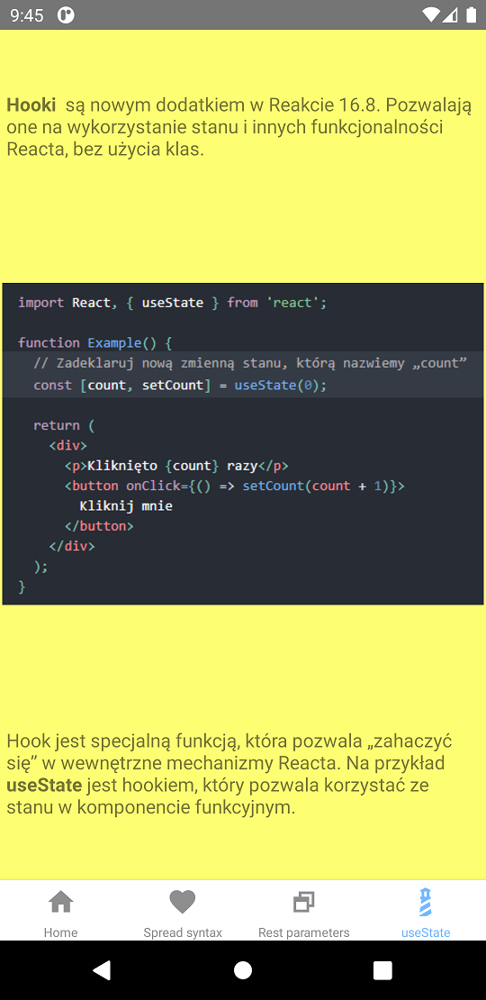

# aplikacje-mobilne-21716-185IC Lab2 - responsywne layouty + nawigacja

## kod programu

### 1) Zawartość pliku App.js

### 2) Zawartość pliku App/Home.js

### 3) Zawartość pliku App/Page1.js

### 4) Zawartość pliku App/Page2.js

### 5) Zawartość pliku App/Page3.js

### 5) Część kodu pliku style/styles.js

## przykład działania programu

