# aplikacje-mobilne-21716-185IC Lab2 - responsywne layouty + nawigacja

## kod programu

## 1) Kod pliku App/Home.js
### Sortowanie i filtorwanie liczb.
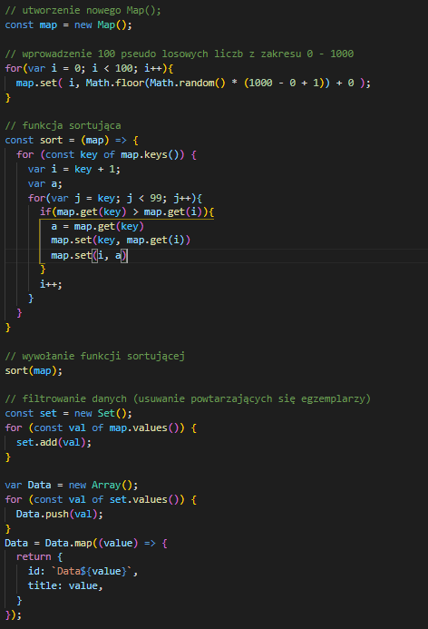

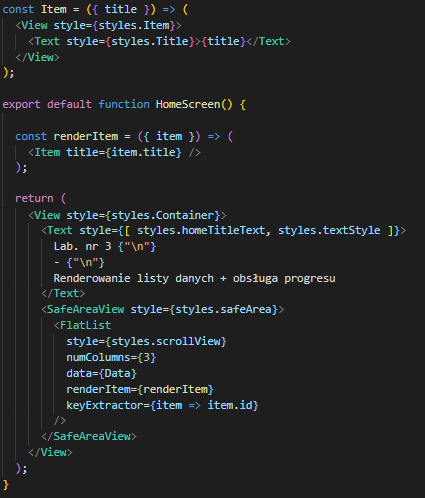

## 2) Kod pliku App/Page1.js
### Renderowanie dynamicznie importowanych komponentów
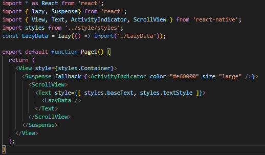

## 3) Kod pliku App/LazyData.js
### Funkcja generująca ciąg znaków o długości 5 - 10.
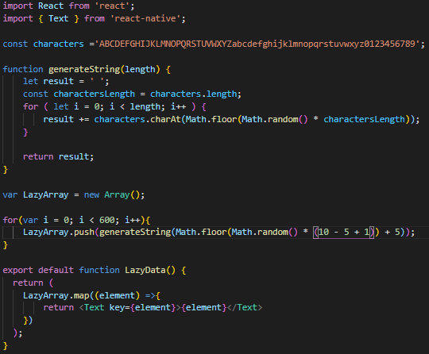

## 4) Kod pliku App/Page2.js
### Progres krokowy zawierający 5 kroków.
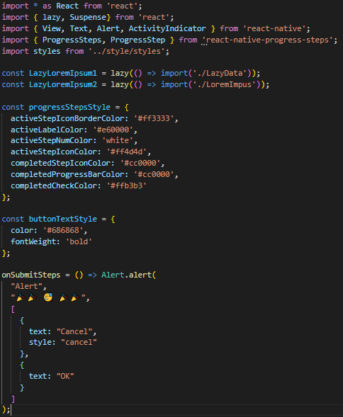

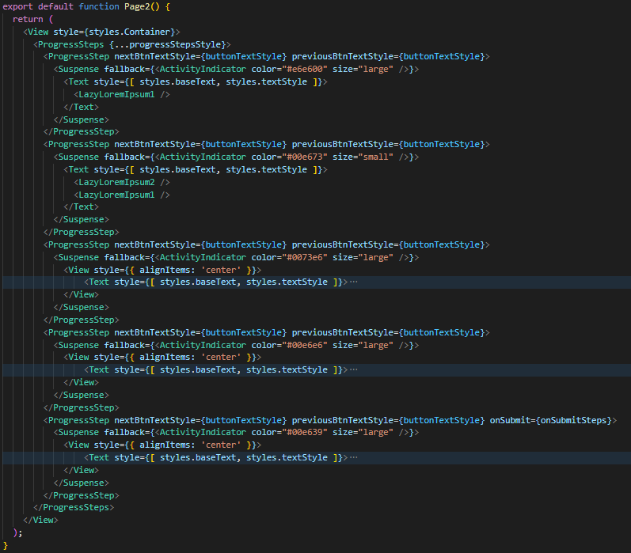

## 5) Kod pliku App/LoremImpus.js
### Jakiś losowy tekst
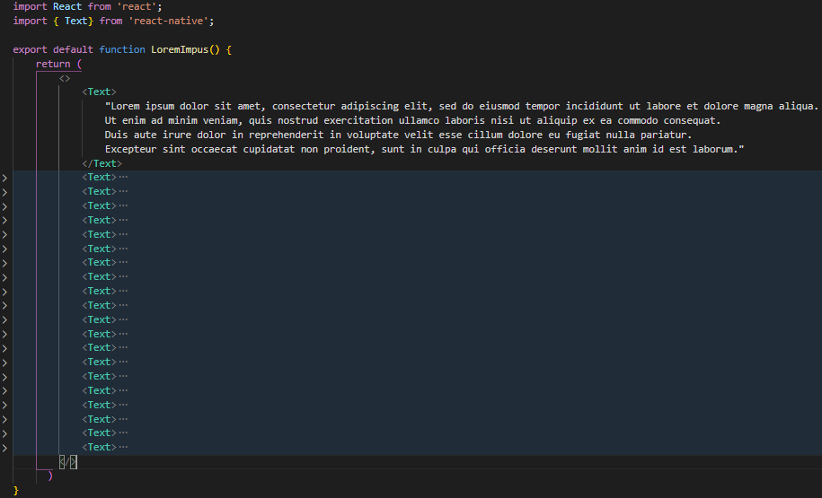

## przykład działania aplikacji
### Strona startowa: wyświetlenie posortowanych i przefiltorwanych 100 pseudolosowych liczb, z zakresu 0 - 1000.

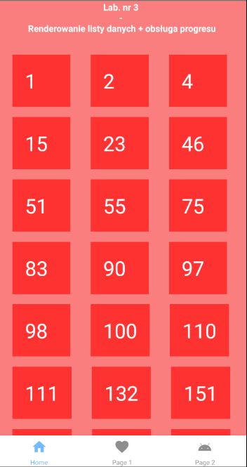

### Druga strona: (lazy loading) wyświetlenie danych dopiero po ich całkowitym wczytaniu na stronę, w między czasie wyświtlanie obrazka ładowania.

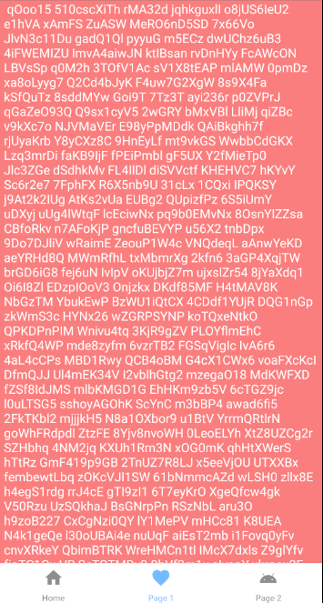

### Trzecia strona: progres krokowy.

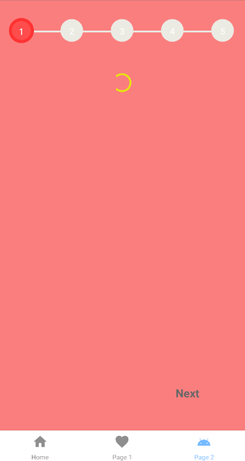

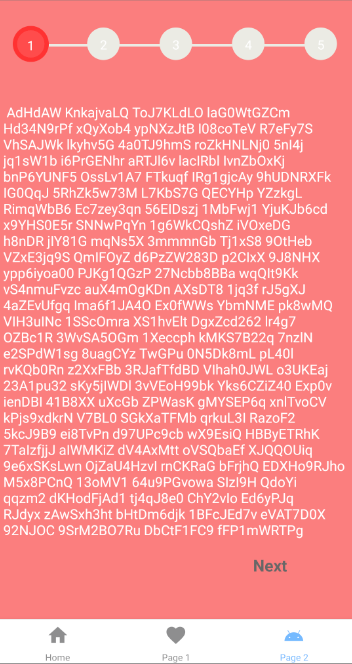

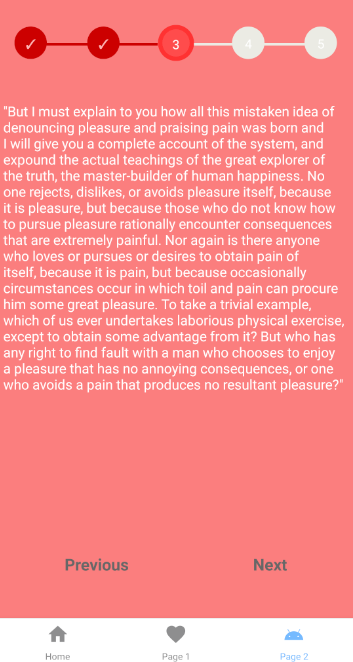

### Na ostatnim kroku wyświetla się przycisk `Submit`, po jego wciśnięciu wyskakuje `Alert`.

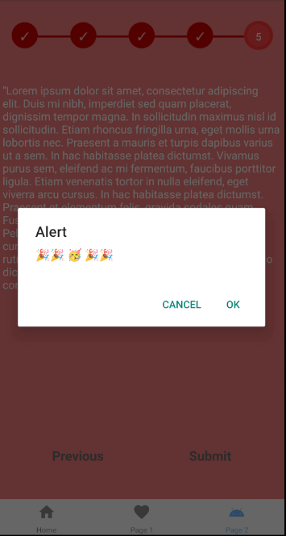