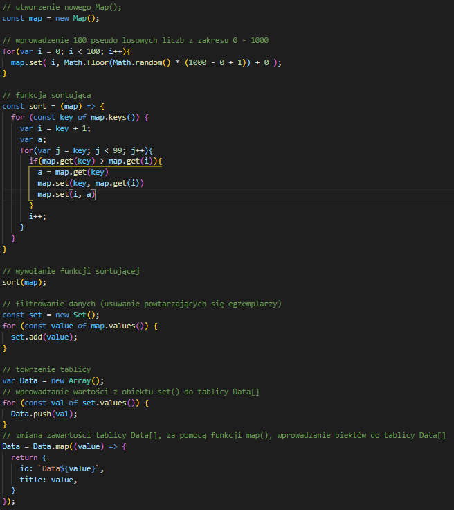

# aplikacje-mobilne-21716-185IC Lab2 - responsywne layouty + nawigacja

## kod programu

### 1) Kod pliku App/Home.js

### 2) Kodpliku App/Page1.js
### Renderowanie dynamicznie importowanych komponentów

### 3) Kod pliku App/LazyData.js

### 4) Kod pliku App/Page2.js

### 6 Kod pliku App/LoremImpus.js

## przykład działania aplikacji

