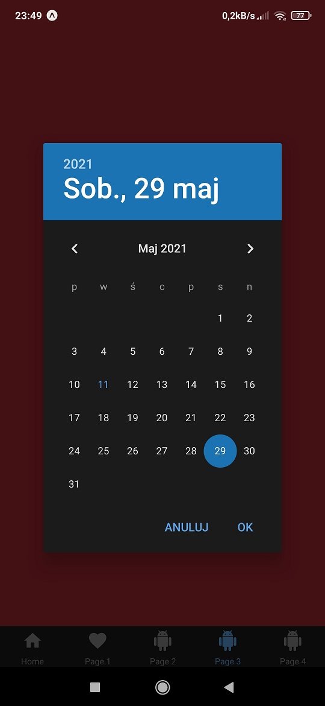
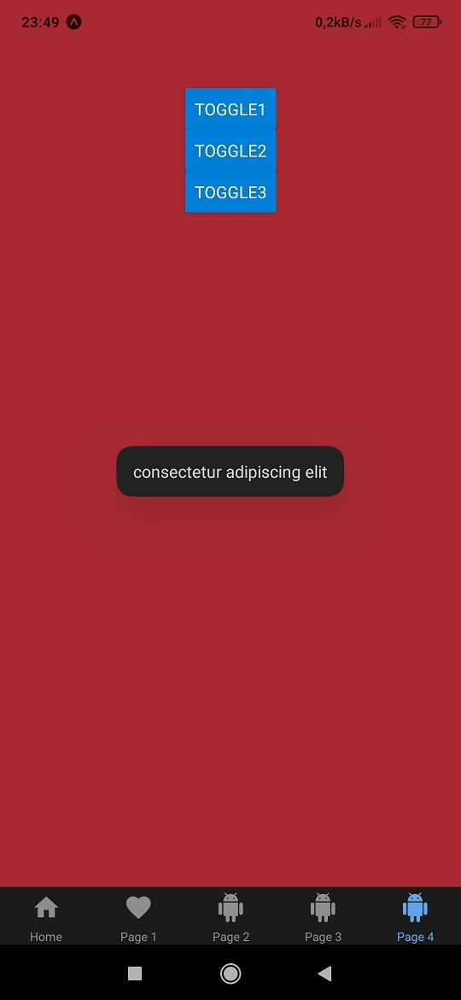

# aplikacje-mobilne-21716-185IC Lab4 - obsługa danych wprowadzanych przez użytkownika + modale

## kod programu

## 1) Kod pliku components/Home.js
### Wykorzystanie komponentu `TextInput`.

## 2) Kod pliku components/Page1.js
### Wykorzystanie komponentu `Picker`.

## 3) Kod pliku components/Page2.js
### Wykorzystanie komponentu `Switch` oraz `Modal`.

## 4) Kod pliku components/Page3.js
### Wykorzystanie komponentu `DateTimePicker`

## 5) Kod pliku components/Page4.js
### Wykorzystanie komponentu `ToastAndroid`

## przykład działania aplikacji
### Strona startowa: Dane wprowadzone do `TextInput` są automatycznie wyświetlane poniżej.

### Druga strona: Na androidzie komponent `Picker` nie zadziałał tak jak powinien. :(

### Trzecia strona: Po przesunięciu `Switcha` pojawia się `Modal` z pseudolosową liczą.

### Czwarta strona: Po wciśnięciu przycisku `Wyświetl datę` oraz `Wyświetl godzinę` wyskakują DataTimePiker'y które można dowolnie ustawić, następnie klikając `wyświetl termin` wyskoczy alert z wcześniej ustawionymi datami.

### Piąta strona: Po wciśnięciu dowolnego przycisku wyskoczy powiadomienie, dla każdego przycisku pojawi się w innym miejscu, czas wyświtlania dla każdego powiadomienia jest taki sam. Można ustawić jedą z dwuch długości short lub long.

