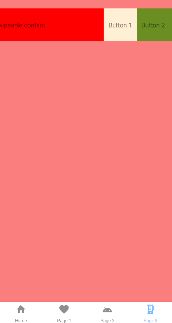

# aplikacje-mobilne-21716-185IC Lab5 - obsługa gestów użytkownika

## kod programu

## 1) Kod pliku components/Home.js
### Użycie komponentu ScrollView, oraz kodu z poprzednich lab. do wygnerowania losowych liczb.

## 2) Kod pliku components/Page1.js
### 

## 3) Kod pliku components/Page2.js
### 

## 4) Kod pliku components/Page3.js
### 

## przykład działania aplikacji
### Strona startowa: wyświetlona zostaje lista którą można przewijać.

### Druga strona: wyświetlony zostaje tekst którą można przewijać.

### Trzecia strona: wykorzystanie komponentów `TouchableOpacity` oraz `TouchableHighlight`.
#### Klikając przycisk `Touch Here` licznik zostaje zwiększony o jeden.

#### Klikając przycisk `Press Here` wyskakuje okno z alertem.

### Ostatnia strona: wykorzystanie komponentu `Swipeable`.
### Przesuwając kompnent w prawo pojawi się napis `keep pulling!`.

### Po przesunięciu komponentu o 200 pixeli w prawo napis zmieni się na `release!`.

### Po przesunięciu komponentu w lewo pojawią się 2 przyciski.

