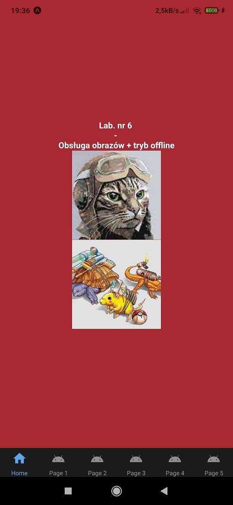
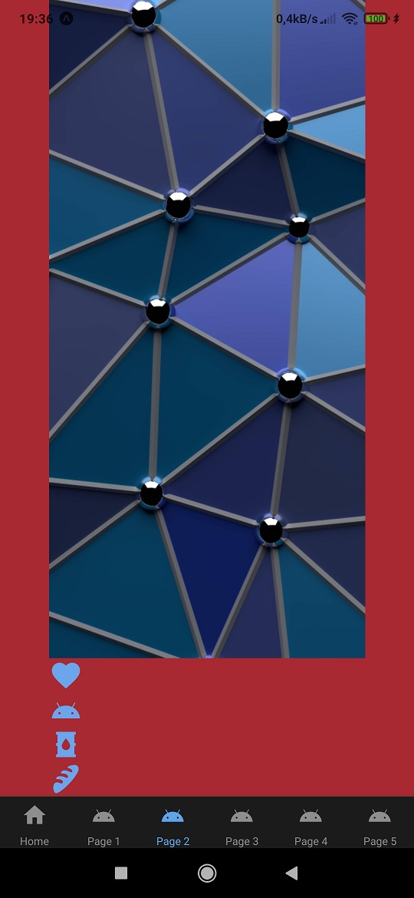
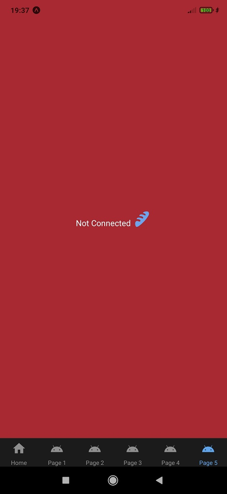

# aplikacje-mobilne-21716-185IC Lab6 - obsługa obrazów + tryb offline

## kod programu

## 1) Kod pliku components/Home.js
### Wczytanie obrazków za pomocą `require()`, oraz `uri`.

## 2) Kod pliku components/Page1.js
### Użycie komponentu `slider` do zmiany rozmiaru obrazka.

## 3) Kod pliku components/Page2.js
### Użycie lazy do 'leniwego' wczytywania obrazków oraz ikon.

## 4) Kod pliku components/Page3.js
### Detekcja lączności, w zależności od stanu wyświetla komunikat `Connected` lub `Not Connected`

## 5) Kod pliku components/Page4.js
### Obsługa zapisu danych za pomocą `async-storage`

## 6) Kod pliku components/Page5.js
### Synchronizacja danych. W zależności od stanu połączenia, zostaje wyświetlona odpowiednia treść.

## przykład działania aplikacji
### Strona startowa: Wyświetlone zostają 2 obrazki za pomocą 2 różnych metod.

### Druga strona: Zmiana rozmiaru obrazka, za pomocą suwaka.

### Trzecia strona: 'leniwe' ładowanie obrazka i ikon (nie są zbyt ciężkie, nie dało się uchwycić procesu ładowania).

### Czwarta strona: Urządzenie posiada połączenie, zostaje wyświetlony odpowiedni komunikat.

### Piąta strona: Wprowadzenie tekstu do input'a i wciśnięcie przycisku `OK` spowoduje przechowanie tekstu, wciśnięcie przcisku `PRESS` spowoduje wyświetlenie przechowywanego tekstu.

### Ostatnia strona: W zależności od stanu połączenia, zostanie wyświetlona odpowiednia treść.

