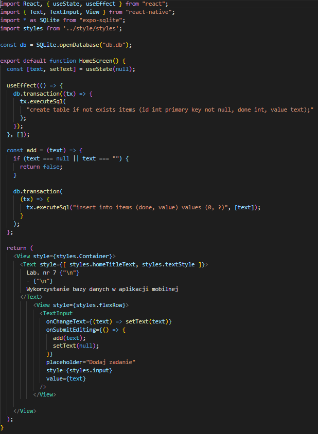
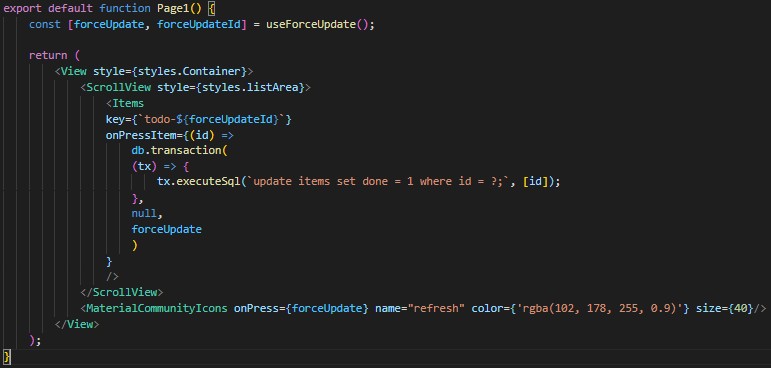
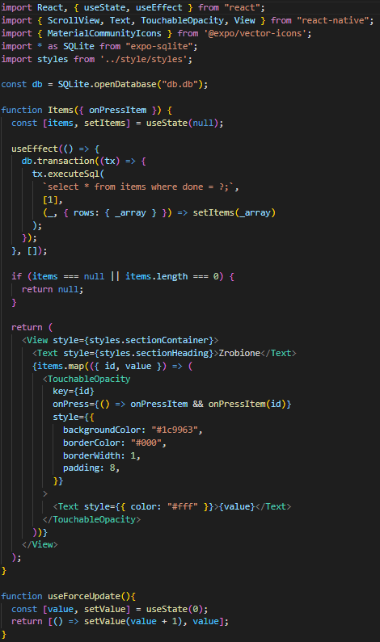
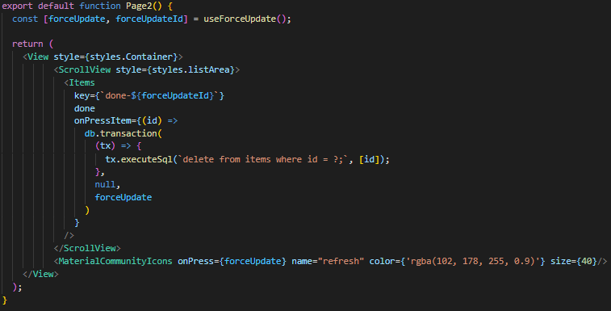
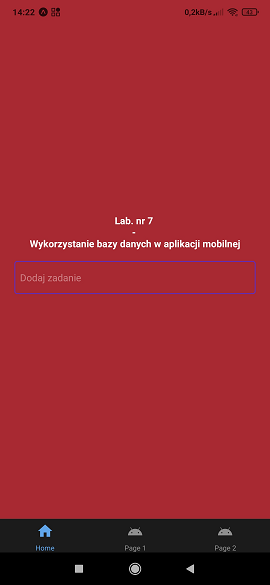
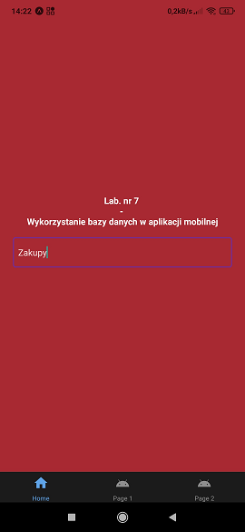
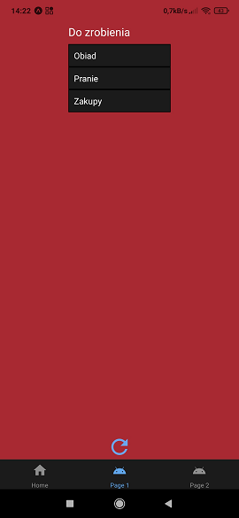
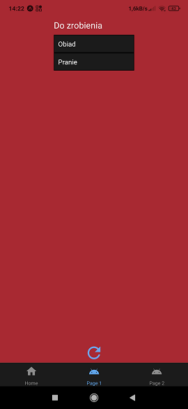
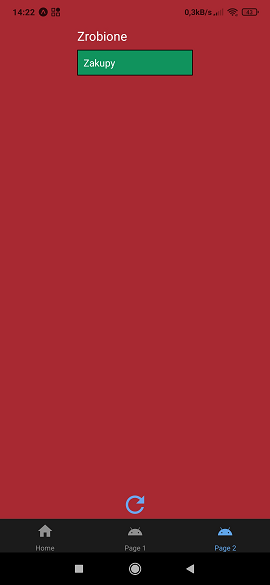
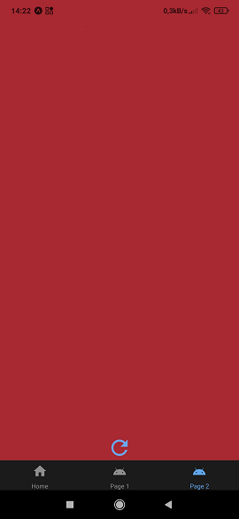

# aplikacje-mobilne-21716-185IC Lab7 - wykorzystanie bazy danych w aplikacji mobilnej

## kod programu

## 1) Kod pliku components/Home.js
### Otwarta zostaje baza danych, jeżeli nie instnieje zostaje utworzona.
### Jeżeli nie instnieje utworzona zostaje tablica o nazwie items, zawierająca kolumne klucz główny id typu int, kolumne done typu int, oraz kolumne value typu text.
### Po zatwierdzeniu treści wprowadzonej do TextInput, zostaje wywołana funkcja add() która wprowadza dane do bazy, oraz setText() która zmnienia wartość zmiennej text na null, usuwając zawartość TextInput. 

## 2) Kod pliku components/Page1.js
### Wciśnięcie symbolu odświeżania wywoła forceUpdate, która odświeży zawartość strony i wyświetli aktualne dane z bazy.
### Wyświetlone zostają wszystkie rekordy z bazy danych dla których done ma wartość = 0.
### Po wciśnięciu komponentu, wartość done wybranego komponentu o przypisanym id zmienia wartość na 1, i przestaje być wyświetlany na tej zakładce.

## 3) Kod pliku components/Page2.js
### Wciśnięcie symbolu odświeżania wywoła forceUpdate, która odświeży zawartość strony i wyświetli aktualne dane z bazy.
### Wyświetlone zostają wszystkie rekordy z bazy danych dla których done ma wartość = 1.
### Po wciśnięciu komponentu zostaje on usunięty za bazy.

## przykład działania aplikacji
### Strona startowa: 

### Dodanie zakupów do listy

### Druga strona: Wyświetlenie zakupów na liście do zrobienia

### Oznaczenie zakupów jako zrobione

### Trzecia strona: Wyświetlenie zakupów na liście zrobionych

### Usunięcie zakupów z listy. W przypadku braku danych do wyświetlenia napis `Zrobione` równierz nie jest wyświetlany.

